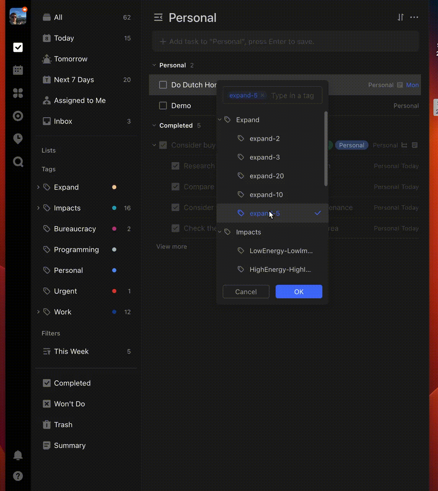
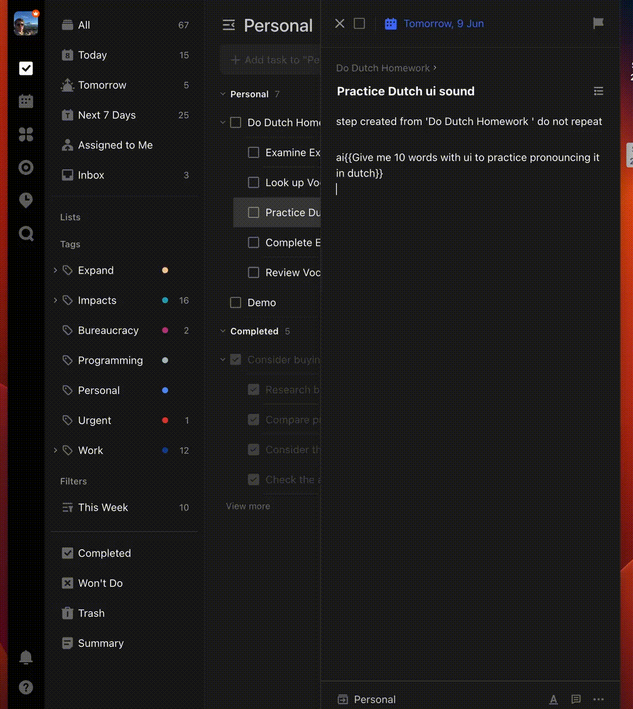

# TickGPTick

This year I found out I had ADHD. In an attempt to address some of the symptoms I've started to experiment with different tools and methodologies. 

One thing that came up a lot was breaking tasks down into smaller tasks. For instance, going to the gym would be made up of changing into gym clothes, putting your gym bag by the door. This 'atomicising' of your todo list is supposed to help keep people with ADHD motivated to complete a task. 

But I've always lacked the creativity for this. I've always had an incredibly difficult time breaking down tasks into incredibly small tasks. So I turned to ChatGPT. And it was good at it. Not perfect, but much better than me, and a much better starting point that I could provide. 

And as the lazy man I've always been, I figured, why not complicate it and try to build it directly into TickTick. 

I run this locally on a Raspberry Pi, and it polls every second for changes. It then does two things. 

## Expand

By adding a tag like expand-5 TickGPTick calls ChatGPT. It returns a list of 5 broken down tasks. It uses the description field for additional context when creating them. The gif below demonstrates this functionality. 

## AI Descriptions.

If you type ai{{a prompt}} into the description field, in the background the OpenAI API will be called. It will Replace the content in the description field with AI Generated Content. 

# ToDo: 

* Error handling, any at all. 

# .env

The following environment variables must be set in order for this application to work 

## OPENAI_API_KEY
Your Open AI API Key. 

## TICKUSERNAME
Your Tick Tick Username 

## TICKPASSWORD
Your Tick Tick Password
